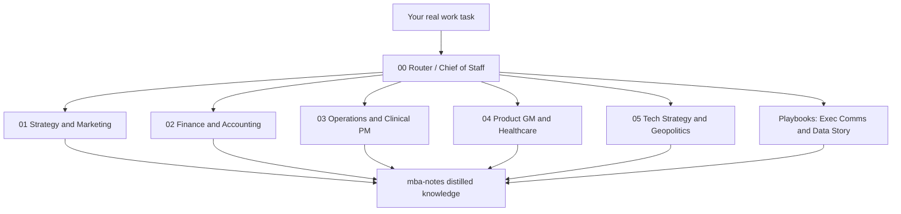

# MBA × Industry Consultant Agents — Development Plan (v2)

> Revised: 2026-07-17  
> Basis: HKUST MBA courses completed / in progress (syllabi) + career roles (Clinical Project Manager / Product Manager / General Manager at Hong Kong subsidiaries)  
> vs v1: Expanded from “6 core courses → 4 consultants” to “13-course knowledge map → 5 consultants + communication/data playbooks,” plus a **course-note distillation pipeline**.

---

## 1. Your course assets (13 courses)

| Term | Code | Course | Career value |
|------|------|--------|--------------|
| Fall 2025 | ACCT5100 | Corporate Reporting | Read statements, financial health, ESG/governance red flags → HQ communication |
| Fall 2025 | ECON5110 | Managerial Microeconomics | Pricing, cost, competition, game theory → product/market decisions |
| Fall 2025 | ISOM5020 | Technology Strategy & Management | Internal IT decisions + external impact of emerging tech |
| Fall 2025 | MARK5120 | Marketing Strategy | STP, marketing planning, framework-based marketing problem solving |
| Spring 2026 | FINA5120 | Corporate Finance | NPV/capital budgeting, risk-return, cost of capital |
| Spring 2026 | ISOM5120 | Visualizing Data for Business Decisions | Executive dashboards, data storytelling, decision visualization |
| Spring 2026 | ISOM5700 | Operations Management | Process, supply chain, service ops → Clinical PM / delivery |
| Spring 2026 | MGMT5410 | Strategic Management | Five Forces, value chain, strategy triangle, business-unit strategy plans |
| Spring 2026 | MGMT6501Q | Communication for Business Leaders | One-to-many / one-to-one / meetings, feedback, briefing rhythm |
| Spring 2026 | MGMT6501T | Developing to be an Effective CEO | CEO/C-suite decisions, board lens, working with senior leaders |
| Spring 2026 | SBMT6012G | Geopolitics of Emerging Tech | AI/semiconductors/export controls/supply-chain geopolitical risk |
| Summer 2026 | MGMT6501W | Innovation in Healthcare (Entrepreneurial & Investor) | Healthcare innovation, unmet needs, business models, investor lens |
| Winter 2026 | MGMT5590 | Responsible Leadership | Stakeholder tradeoffs, ethical conflict, responsible decision-making |

**Unchanged principle:** Do **not** build one agent per course. Courses are **knowledge sources**; agents are **career task interfaces**.

---

## 2. Revised agent architecture



### Why 5 consultants instead of 4?

v1 folded “tech / geopolitics” into Strategy or GM. That is not enough for your context: in healthcare/clinical product and subsidiary decisions, **export controls, supply chain, and tech adoption** show up repeatedly. That deserves a dedicated fifth consultant.

**Do not** create separate “Communication” or “Data Visualization” agents. Those are **output capabilities**—attach them via playbooks/skills to every consultant (avoids persona sprawl).

---

## 3. Course → agent map (how to use your knowledge)

### 00 — Router / Chief of Staff

| Feed from | How to use |
|-----------|------------|
| MGMT6501Q | Ask first: Who is the audience? One-to-many / one-to-one / meeting? What does success look like? |
| MGMT6501T | Decide whether to escalate tone to “GM / board-ready” |
| MGMT5590 | Force sensitivity tier + ethics / stakeholder check |
| All courses | Route to the right consultant; pick tool (Cursor / Gemini / Perplexity) |

**Career triggers:** “Which advisor should own this?” “Can this material leave the building?” “HQ vs team audience?”

---

### 01 — Strategy & Marketing Consultant

| Feed from | Frameworks / capabilities |
|-----------|---------------------------|
| MGMT5410 | Five Forces, value chain/ecosystem, strategy triangle, BCG/GE, strategy recommendation |
| MARK5120 | Marketing decision frameworks, marketing planning, case-style problem structuring |
| ECON5110 | Demand/cost/pricing, market structure, games and incentives |

**Career triggers (PM / GM):** HK positioning, pricing, channels, competitors, enter/exit, value proposition.

---

### 02 — Finance & Accounting Consultant

| Feed from | Frameworks / capabilities |
|-----------|---------------------------|
| FINA5120 | Discounted cash flows, capital budgeting, risk-return, cost of capital |
| ACCT5100 | Three-statement literacy, adjustments/comparability, fraud/governance red flags, ESG reporting awareness |

**Career triggers (GM / HQ):** Budgets, investment cases, project finance, reading peer or parent statements, management-reporting narrative.

---

### 03 — Operations & Clinical PM Consultant

| Feed from | Frameworks / capabilities |
|-----------|---------------------------|
| ISOM5700 | Process, capacity, supply-demand matching, supply chain, service operations, GM lens on operations |
| (Industry experience) | Clinical projects: milestones, regulatory gates, RAID, cross-functional RACI |

**Career triggers (Clinical PM):** Timeline, bottlenecks, resources, risk escalation, delivery health.

---

### 04 — Product / GM / Healthcare Decision Consultant (renamed)

| Feed from | Frameworks / capabilities |
|-----------|---------------------------|
| MGMT6501T | CEO decision logic, board/C-suite collaboration, development-project tradeoffs |
| MGMT6501W | Healthcare innovation ecosystem, unmet needs, value proposition, entrepreneurial/investor lens, funding narrative |
| MGMT5590 | Shareholders vs stakeholders, ethical conflict, bias and responsible decisions |
| MGMT5410 | Business-unit strategy plan (executive integration) |

**Career triggers (PM / GM):** Prioritization, “do X / don’t Y,” healthcare product/project investment logic, one-pagers up and down.

---

### 05 — Tech Strategy & Geopolitics Consultant (**new**)

| Feed from | Frameworks / capabilities |
|-----------|---------------------------|
| ISOM5020 | Internal technology management + external strategy for emerging tech |
| SBMT6012G | Technical grounding (e.g. AI/semiconductors), export controls, supply-chain vulnerability, corporate response strategies |

**Career triggers:** Adopt a system/platform or not, supplier geopolitical risk, cross-border data/equipment compliance, localizing parent tech roadmaps.

---

### Cross-cutting capabilities (playbooks/skills, not personas)

| Course | Artifact |
|--------|----------|
| MGMT6501Q | `playbooks/exec-comms.md`: upward brief, difficult 1:1, meeting + Q&A |
| ISOM5120 | `playbooks/data-story-brief.md`: dashboard/chart choice, audience-led data story |

When any consultant produces “materials for HQ/board,” the Router can attach these two playbooks.

---

## 4. Turning OneDrive notes into agent-usable knowledge

Syllabi tell the agent **what it should know**; **your distilled notes** create differentiation.

### Suggested folder layout (inside the existing vault)

```text
consultant-agents/mba-notes/
├── _index.md                 # course → frameworks → agent mapping
├── ACCT5100/
│   ├── frameworks.md         # three statements, red flags, ESG points (in your words)
│   └── cheat-sheet.md        # one-page quick reference
├── ECON5110/
├── ISOM5020/
├── MARK5120/
├── FINA5120/
├── ISOM5120/
├── ISOM5700/
├── MGMT5410/
├── MGMT6501Q/
├── MGMT6501T/
├── SBMT6012G/
├── MGMT6501W/
└── MGMT5590/
```

### Distill only 3 file types per course (do not dump full lecture packs into prompts)

1. **frameworks.md** — frameworks you actually use + when to use / not use them  
2. **cheat-sheet.md** — one-page formulas / checklists (for agent citation)  
3. **career-hooks.md** — “5 ways this course shows up in my Clinical PM / PM / GM work”

### Distillation privacy rules

| Content | Sensitivity | Where it goes |
|---------|-------------|---------------|
| Course frameworks, public case notes | Low | `mba-notes/` |
| Assignments rewritten with real company numbers | Mid → de-identify first | Only after de-ID |
| Unpublished strategy / clinical raw material | High | `work-briefs/` only — never into mba-notes |

Rule of thumb: **Raw notes can stay in OneDrive; agents only read distilled markdown.**

### Distillation priority (by career ROI)

**Wave 1 (strengthen the current 4 consultants this week):**

1. MGMT5410 → 01  
2. MARK5120 + ECON5110 → 01  
3. FINA5120 + ACCT5100 → 02  
4. ISOM5700 → 03  
5. MGMT6501T + MGMT6501W + MGMT5590 → 04  

**Wave 2 (enable new consultant 05 + communication playbooks):**

6. ISOM5020 + SBMT6012G → 05  
7. MGMT6501Q + ISOM5120 → playbooks  

Target per course: **~90 minutes** to produce frameworks + cheat-sheet. Do not aim for perfect transcription.

---

## 5. Aligning to your career triangle (task scenes, not duplicate personas)

| Your role | Primary consultant | Frequent support | Typical output |
|-----------|--------------------|------------------|----------------|
| Clinical PM | 03 Ops | 02 Finance (resources), 05 Tech (systems/supply) | RAID, weekly plan, escalation memo |
| Product Manager | 01 Strategy-Mkt or 04 Product-GM | 05 Tech, 02 Finance | Positioning/priority, roadmap tradeoffs |
| General Manager | 04 Product-GM | 01, 02, 05, Comms playbook | Decision one-pager, HQ narrative |

Router assigns **one primary + at most one support** each time—no five-way panel answers.

---

## 6. Tool split (same as v1, slightly reinforced)

| Sensitivity | Tool | MBA note usage |
|-------------|------|----------------|
| Low | Perplexity (public intel) + any | Market/regulatory public facts → distill into `industry/` |
| Mid | Gemini Enterprise | Long meetings/multi-file; upload only **de-identified** mba-notes summaries |
| High | Cursor local vault | Company raw material only in `work-briefs/`; use `deidentify-brief` before export |

**Course PDFs:** Keep originals in OneDrive. Put only your distilled `.md` into the vault (cleaner for copyright, size, and privacy).

---

## 7. Implementation roadmap (revised)

### Phase A — Knowledge base (1–2 weeks)

- [ ] Create `mba-notes/_index.md` and 13 course folders  
- [ ] Finish Wave 1 distillations (table above)  
- [ ] Update each agent prompt: “Prefer citing `mba-notes/<CODE>/cheat-sheet.md`”

### Phase B — Agent upgrades (in parallel with A)

- [ ] Revise `01`–`04`: add course knowledge maps (from syllabi + your cheat-sheets)  
- [ ] **Add** `05-tech-geopolitics.md` + Router routing rules  
- [ ] Add playbooks: `exec-comms.md`, `data-story-brief.md`  
- [ ] Optional Cursor skill: `mba-note-distill` (turn one course’s notes into frameworks/cheat-sheet)

### Phase C — Career calibration (ongoing)

Each week, run **2 real work problems** end-to-end:

1. Router (sensitivity + consultant)  
2. Primary consultant (cite mba-notes)  
3. If for HQ → attach Exec Comms / Data Story playbook  
4. Save strong outputs back into `playbooks/` or `industry/`

Two-week self-check (upgraded):

- [ ] You can name “which course frameworks apply” — not only “which bot”  
- [ ] At least 5 courses have usable cheat-sheets  
- [ ] 05 Tech-Geopolitics has solved at least one real supply/tech decision  
- [ ] High-sensitivity raw material still never goes to Perplexity  

---

## 8. Explicitly out of scope (for now)

- Do not build 13 “course professor” agents  
- Do not bulk-upload the OneDrive lecture library to external LLMs  
- Do not split Clinical PM / PM / GM into three duplicate personas  
- Do not build custom RAG until you use this system >5 times/week **and** have ~20+ distilled cheat-sheets  

---

## 9. Relationship to the existing vault

Already in place and reusable:

- `consultant-agents/privacy-policy.md`  
- `agents/00`–`04`  
- Playbooks: decision one-pager, project risk, finance Q&A  
- Skills: `consultant-router`, `deidentify-brief`, `decision-one-pager`  

v2 incremental deliverables (when you ask to implement):

1. `mba-notes/_index.md` + course folder skeleton  
2. `agents/05-tech-geopolitics.md`  
3. Revised course-knowledge sections in `00`–`04`  
4. `playbooks/exec-comms.md`, `playbooks/data-story-brief.md`  
5. (Optional) personal skill `mba-note-distill`  

---

## 10. One-line summary

Turn 13 MBA courses into **5 career consultants as the knowledge backend + 2 communication/data output templates**; use distilled notes as your edge, and real work problems as the calibrator—not another pile of chatbots.
