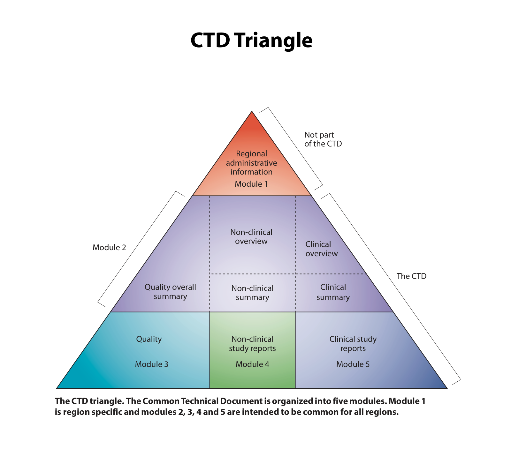

# HK NDA registration, “1+” mechanism, and CTD (PM)

> Public PPB / Drug Office guidance. **Not legal advice.** Legislation (Cap. 138 and related) prevails.  
> **Sensitivity:** Low.  
> **Use when:** HK product registration path, line extension vs new indication, “1+” / abridged / verification / primary evaluation, Pre-NDA meetings, evaluation clock, CTD dossier shape, post-registration PV obligations that affect commercial timelines.

## Source files (in this vault)

| File | What it is |
|------|------------|
| [source/guidance_notes_nda_31_Mar_2026.pdf](source/guidance_notes_nda_31_Mar_2026.pdf) | *Guidance Notes on Registration of Pharmaceutical Products: New Drug Applications* — PPB, **v1.0, 31 Mar 2026** (25 pp.) |
| [source/onePlus_Pre-NDA_Meeting_Guidance_en.pdf](source/onePlus_Pre-NDA_Meeting_Guidance_en.pdf) | Pre-NDA meetings for initial registration under the **“1+” mechanism** (Mar 2026, 5 pp.) |
| [source/stop_clock_en.pdf](source/stop_clock_en.pdf) | Pilot **stop-clock** flowchart for “1+” NDA evaluation (1 slide) |
| [source/CTD_triangle_color_Proofread.pdf](source/CTD_triangle_color_Proofread.pdf) / [source/CTD_triangle.png](source/CTD_triangle.png) | ICH **CTD triangle** (Modules 1–5) |

## Why this matters for the BESREMi PM

- **BESREMi is already registered and launched in HK (Oct 2025).** This library is for *future* registration events — not for re-arguing the original launch.
- **New indication / posology / population (e.g. ET or MF)** = typically **NDA-2B** and needs non-clinical and/or clinical data. That remains **investigational / reactive-only** in HK until locally registered. Do **not** treat this file as permission to plan proactive ET/MF promotion.
- **Line extensions** (new strength, dose form, route, combination, container that may change safety/efficacy) = **NDA-2**; administrative / non-impact changes = **NDA-3**.
- **“1+” mechanism** (from 31 Mar 2026, under the **abridged evaluation** route) is the HQ-relevant option when a product has an orphan / breakthrough / priority (or equivalent) approval in a listed reference market **and** Chinese/Asian or local clinical data. Use for pipeline / next-asset access planning, not for on-label PV claims.
- **RA / Drug Office owns the dossier.** PM uses this file for **timeline, access, PSP/formulary sequencing, and HQ narrative** — not to invent Module 3–5 content.

**Tie-back to role memory:** Compliance → Formulary/public access → HQ strategic fit. Registration path is a hard gate for any new claim or indication.

---

## Who applies (imported product)

For a product manufactured **outside** Hong Kong, the applicant is the **licensed wholesale dealer who imports** it, **or** the HK branch / subsidiary / representative / agent / distributor of the overseas manufacturer.

- Submit via **PRS 2.0** (`www.drugoffice.gov.hk/prs2-ext/client_authentication.jsp`).
- PDFs must be flattened, text-searchable, not encrypted; include ToC, hyperlinks, bookmarks.
- **Application fee:** HK$1,100 (at time of guidance). **Registration fee on approval:** HK$1,370 per product.
- Screening completeness window: outstanding documents within **60 calendar days** or the NDA is **refused for filing** (a new application can be submitted).
- Enquiries: Drug Evaluation and Pharmacovigilance Division, Drug Office — Tel **3974 4175**; Pre-NDA email **pharmgeneral@dh.gov.hk**.

## NDA categories (initial registration)

| Category | Meaning | PM examples |
|----------|---------|-------------|
| **NDA-1** | New chemical or biological entity not previously registered in HK | First HK registration of a new asset |
| **NDA-2** | Registered entity, but needs non-clinical and/or clinical data | **2B new indication / dosage / population**; 2C new strength; 2D new dose form; 2E new route; 2H new combination; 2A new salt/ester/isomer if it changes S/E; 2F composition change that may affect S/E; 2G container/presentation that may affect S/E |
| **NDA-3** | Subsequent registration of an already-registered NDA-1/2 product **without** new non-clinical/clinical data | 3A non-impact excipient (e.g. colourant); 3B new manufacturer on label; 3C pack/presentation that does **not** change S/E; 3E new trade name |

**Not this NDA guidance:** generic/reference-product applications that only need bioequivalence; biosimilars; biologicals that do not differ significantly in S/E — those have separate PPB notes.

**Same vs separate applications**

- Non-injectable products that differ **only** in pack size: one application (or a change-of-particulars filing).
- **Separate** applications: different strengths; different dose forms; more than one presentation for the same pack size (unless justified); **injectables with different container volumes**.

## Evaluation routes

| Route | When eligible | Extra PM/RA implication |
|-------|---------------|-------------------------|
| **Verification** | Approved in **two or more** listed reference countries/places (ATP: EU approvals must be from **EMA**) | CTD Modules 2, 3, 5 (Module 4 if needed); PI comparison vs reference markets; at least one listed-market PI to support the HK insert |
| **Abridged** (includes **“1+”** from 31 Mar 2026) | **Either** (i) local unmet need for PHE / specified communicable-disease / AMR use **and** promulgation by WHO or equivalent; **or** (ii) **“1+”**: orphan / breakthrough / priority (or equivalent prominent clinical benefit) **and** currently on market in a listed country **and** local **or** Chinese/Asian clinical data (ICH E5 ethnic-factors logic) | Cover letter + eligibility evidence; **local expert** S/E assessment (fellowship or equivalent, **≥5 years** in-field); for “1+”: unredacted reference-authority assessment reports, post-registration development plan. Ineligible abridged filings may be refused at screening — verification remains open |
| **Primary** | **Not** approved in any listed country | **Pre-NDA meeting is mandatory** before filing. Phase 1 of primary evaluation: **NDA-2 or NDA-3 of chemical entities only**. Incomplete CTD may be refused; abridged/verification still available if eligibility appears later |

**Listed reference countries/places** (guidance Table 2): Australia, Austria, Belgium, Brazil, Bulgaria, Canada, **Chinese Mainland**, Cyprus, Czech Republic, Denmark, Estonia, Finland, France, Germany, Greece, Hungary, Ireland, Italy, Japan, Republic of Korea, Latvia, Lithuania, Luxembourg, Malta, the Netherlands, Poland, Portugal, Romania, Singapore, Slovak Republic, Slovenia, Spain, Sweden, Switzerland, the United Kingdom, the United States.

**Do not invent** which route BESREMi originally used. If HQ asks “can we use 1+ for the next asset?”, check orphan/breakthrough/priority status **and** Asian/local data **before** promising a clock.

## CTD shape (what HQ means by “the dossier”)

| Module | Content | HK filing note |
|--------|---------|----------------|
| **1** | Regional administrative information | **Not** part of the common CTD. Uploaded via **PRS 2.0** (selected Module 2–5 subsections also go here for admin) |
| **2** | Quality overall summary; non-clinical overview + summary; clinical overview + summary | Required in all routes; route-specific depth in §§10–12 of the guidance |
| **3** | Quality (drug substance + drug product) | Always |
| **4** | Non-clinical study reports | Verification: may be required; primary: per chemical-entity primary-evaluation notes |
| **5** | Clinical study reports | Verification and abridged: expected where clinical data support the claim |

Guidance: organise Modules **2–5** on **one DVD or Blu-ray** per ICH M4 folder chronology (bookmarks + hyperlinks). Screening/evaluation supplements = submit an **updated complete** disc, not a fragment.

**Always-on Module 1 pack (any route)** includes, among other items: BR certificate; MAH authorisation to the HK applicant; local RA contact authorisation; undertaking with RA **and PV** contacts; cover letter (CTD description, missing-module justification, related products); worldwide marketing-status summary (refusals/withdrawals too); PIC/S GMP certificates; prototype packs + proposed PI + photos; pre-registration named-patient / local CTC history; **HK RMP/REMS**; PBRER if applicable; quality/non-clinical/clinical expert CVs + signed declarations; Module 3 quality core (composition, process, specs, CoA, impurities/ICH Q3D, CCS, stability/ICH Q1). Starred originals/certified true copies (authorisation, CPP, GMP, manufacturer licence) go in hard copy to Drug Office Kwun Tong.

## “1+” Pre-NDA meetings (Mar 2026)

From 31 Mar 2026, “1+” sits under **abridged evaluation**. Meetings are optional for abridged “1+” (unlike **mandatory** pre-NDA for **primary** evaluation).

| Type | Who | Length | Purpose |
|------|-----|--------|---------|
| **Company-focused** | **First-time** “1+” applicants; product approved **or under review** in a listed country | **45 min** (DO intro 10 / company 10 / Q&A 25) | Process briefing — **not** advice on generating a new data package |
| **Product-specific** | Generally **NDA-1** under “1+” | **60 min** (company 10 / DO 50) | Dossier/questions on **existing** studies or the proposed package. Data **evaluation** only happens after NDA filing |

**Mechanics**

- Watch the briefing seminar/video **before** requesting.
- Request via PRS 2.0 with **FORM A**, **≥6 weeks** before proposed dates; DO responds within **4 weeks**.
- Package: FORM A (questions), **≤30** slides, product overview (Annex 1), proposed SmPC/PI. **No changes** after submit; reschedule generally **not** accepted.
- **One** company-focused meeting per first-time applicant; **one** product-specific meeting per NDA-1 under “1+”.
- No recording. No promotion. Requester minutes are **not** acknowledged by Drug Office.
- Incomplete package → meeting declined; a new request can be filed.

## Stop-clock (pilot, “1+” evaluation)

Clock **runs** while Drug Office / Core Team / Committee evaluate; **stops** while the applicant prepares clarifications.

| Clock | Limit / target |
|-------|----------------|
| DO **first response** | Targeted within **30 working days** |
| **Cumulative evaluation** (includes Committee decision) | **150 working days** for “1+”; **100 working days** if **Hospital Authority recommends priority review** |
| **Applicant response** (excluded from evaluation time) | Capped at **120 calendar days** cumulative. At the cap, the file goes to the Committee even if S/E/Q are not fully closed |
| Core Team + Committee transaction | Targeted **30–45 working days** (inside the evaluation clock) |
| GMP inspection / inspectorate follow-up | **Not** inside the 100/150 WD target |

**PM translation:** a “1+” promise of ~150 WD is **Drug Office time only**. Applicant-clock + GMP can stretch wall-clock. HA priority review is the lever that shortens the target to 100 WD — coordinate with market access, do not claim it unilaterally.

## Pharmacovigilance and post-registration (commercial impact)

**During evaluation**

- Overseas regulatory actions (withdrawal, refusal, suspension, clinical hold, safety alert, indication restriction, recall, etc.): report within **72 hours**.
- New information that may **significantly change benefit/risk** (e.g. study stop): report.

**After registration**

- Report **all serious ADRs in Hong Kong**; primary/abridged also **unexpected** local ADRs.
- Implement the proposed **RMP** (abridged: keep aligned to global RMP when it changes; primary: update when B/R or a PV milestone changes).
- Submit **final clinical study reports** when they go to other regulators, plus conclusion + follow-up actions; overseas actions from those studies: **≤72 hours**.
- **PBRER** (or equivalent): every **6 months for 2 years**, then **annually for 3 years** (primary/abridged: every 6 months — confirm current DO instruction).
- Sales control: NCE registration generally waits for **legislative amendment** of the Pharmacy and Poisons Regulations. From **June 2018**, amendment can start once an NDA is **accepted for evaluation** (or listed in a public medical assistance programme), unless the Committee must first advise on indication/dose-dependent control. Orphan/breakthrough/priority products may start this on **first submission** (case by case).

**PM Do/Don’t**

- **Do** treat overseas label cuts, recalls, or study stops as a **72-hour RA + PV + PM** event — freeze new promo claims until RA confirms the HK PI.
- **Do** sequence HA formulary / PSP messaging **behind** the registered PI; a new NDA-2B indication is not a commercial campaign until the certificate exists.
- **Don’t** quote “150 working days to listing” as a launch date.
- **Don’t** use Pre-NDA discussion as evidence of approvability in HCP materials.
- **Don’t** overlook HK patent risk: PPB **does not** consider patents, but Cap. 514 infringement remains the applicant’s problem.

## Agent checklist (registration / line-extension question)

1. Name the **NDA category** (1 / 2x / 3x) from the change being asked — or say “confirm with RA”.
2. Name the **evaluation route** only if eligibility is evidenced (2+ listed approvals vs “1+” vs primary). Otherwise list what must be true.
3. Separate **Drug Office clock** from **applicant clock**, **GMP**, and **Poisons Schedule amendment**.
4. Restate **on-label PV only** for proactive materials; ET/MF stays reactive until a local NDA-2B (or equivalent) is approved.
5. Flag **HA formulary impact**: a new indication or pack does not automatically update HADF listing.
6. Tag sensitivity **Low** for this public guidance; **High** if the user pastes an unpublished dossier or HQ registration strategy.

## What this file is not

- Not the full CTD granularity (stability protocols, impurity specs, ATP-specific notes, chemical-entity **primary-evaluation** module list).
- Not HADF / UMAO / HKAPI promo rules — use [`ha-formulary-access.md`](ha-formulary-access.md) and [`regulatory-compliance.md`](regulatory-compliance.md).
- Not a substitute for RA/Legal on a live filing.
