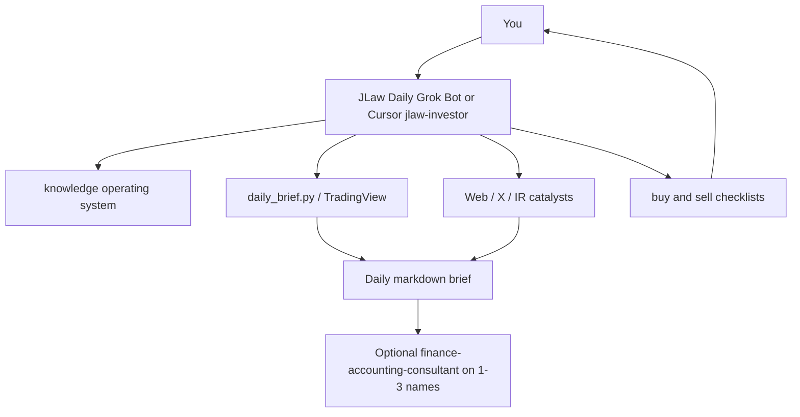

# JLaw Daily — Grok Bot + Cursor

Personal US-equity desk: **screen leaders**, **check news / 催化劑**, **review the watchlist**. Doctrine is distilled from the user's Train-the-Trader materials into `knowledge/` (those PDFs stay on your machine — they are not in git).

> **Disclaimer:** Research support only — not investment, tax, or legal advice. The Bot never places orders.

---

## Start here

| If you use | Do this |
|------------|---------|
| **Grok Bot app** | Follow **[`grok-bot/SETUP.md`](grok-bot/SETUP.md)** (create Bot → skills → weekday routine) |
| **Cursor** | Open the **repo root**, then `Use jlaw-investor.` |

Paste-ready Bot profile: [`grok-bot/PROFILE.md`](grok-bot/PROFILE.md)

---

## What lives in this folder

| Path | Purpose |
|------|---------|
| [`knowledge/jlaw-operating-system.md`](knowledge/jlaw-operating-system.md) | Durable rules (stops, no average-down, 5% chase cap, regime) |
| [`knowledge/buy-checklist.md`](knowledge/buy-checklist.md) | Pre-order gate |
| [`knowledge/sell-checklist.md`](knowledge/sell-checklist.md) | Lock-profit vs risk-control |
| [`playbooks/daily-brief.md`](playbooks/daily-brief.md) | Morning output template |
| [`playbooks/stock-screen.md`](playbooks/stock-screen.md) | Stage 2 quant workflow |
| [`playbooks/news-catalyst.md`](playbooks/news-catalyst.md) | 催化劑 vs 消息 |
| [`playbooks/position-review.md`](playbooks/position-review.md) | Daily holdings / watchlist |
| [`scripts/daily_brief.py`](scripts/daily_brief.py) | Scanner + sector rank + optional earnings dates |
| [`scripts/jlaw_stage2_screen.py`](scripts/jlaw_stage2_screen.py) | TradingView Stage 2 screen (no API key) |
| [`templates/watchlist.example.md`](templates/watchlist.example.md) | Copy to `watchlist.md` (gitignored) |
| TradingView MCP | Live quotes in Cursor (see repo `SETUP-TRADINGVIEW.bat`) |

---

## One-off commands

```bash
pip install -r investment/scripts/requirements-tradingview.txt

python investment/scripts/daily_brief.py --limit 25 --markdown
python investment/scripts/jlaw_stage2_screen.py --limit 40
python investment/scripts/jlaw_stage2_screen.py --hard-only --json
# optional: python investment/scripts/daily_brief.py --limit 10 --earnings
```

Write a file the Bot can reopen:

```bash
python investment/scripts/daily_brief.py --limit 25 --out investment/briefs/$(date +%F).md
```

---

## Weekday loop (Hong Kong)

```text
07:30 HKT  Grok routine posts the brief (prior US session)
           You mark 0–2 names for charts
20:30 HKT  Optional pre-US-open card (see grok-bot/routines/pre-us-open.md)
After fill Stop is live the same day. Never average down.
```

---

## Sensitivity

| Data | Tier | Tool |
|------|------|------|
| Public tickers, news, charts | Low | Grok Bot / Cursor / web |
| Rounded weights | Mid | Local; de-ID before Gemini |
| Broker exports, exact balances, tax lots | High | `work-briefs/` only |

---

## Architecture



Personal investing is **not** routed through the MBA consultant panel unless you ask for a statement/DCF deep dive.

---

## Related

- [Grok Bot setup](grok-bot/SETUP.md)
- [Finance consultant](../agents/02-finance-accounting.md) (finalists only)
- [Privacy policy](../privacy-policy.md)
