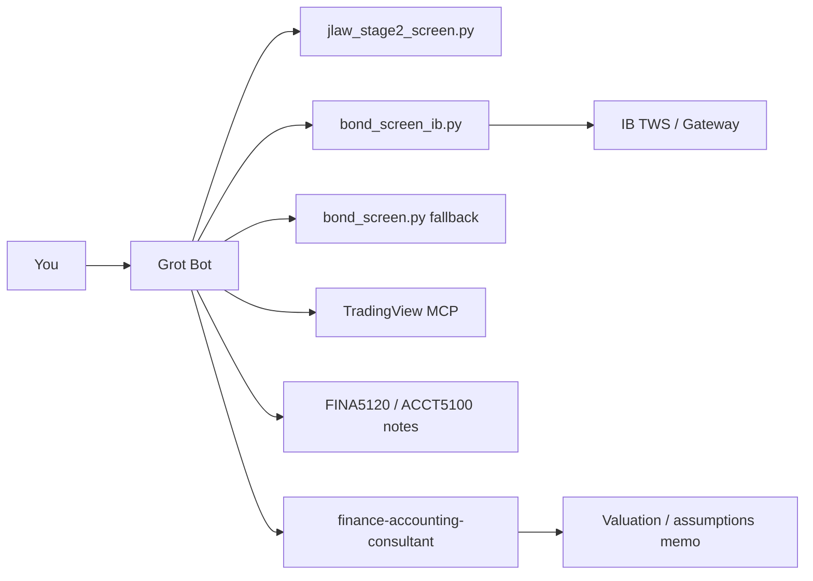

# Grot Bot — Investment Assistant Setup

Personal stock and bond screening assistant, wired to your **MBA finance agents** and local tools.

> **Disclaimer:** Grot Bot is research support only — not investment, tax, or legal advice.

---

## What you get

| Component | Purpose |
|-----------|---------|
| [`agents/grot-bot.md`](agents/grot-bot.md) | System prompt (Cursor skill or Gemini Gem) |
| [`.cursor/skills/grot-bot-investor`](../.cursor/skills/grot-bot-investor/SKILL.md) | Cursor skill — invoke with `Use grot-bot-investor.` |
| [`playbooks/stock-screen.md`](playbooks/stock-screen.md) | JLaw Stage 2 equity workflow |
| [`playbooks/bond-screen.md`](playbooks/bond-screen.md) | **IB TWS** fixed-income workflow (FINA5120) |
| [`SETUP-IB-TWS.md`](SETUP-IB-TWS.md) | One-time TWS API setup for bond screening |
| [`playbooks/portfolio-review.md`](playbooks/portfolio-review.md) | Monthly watchlist / position review |
| [`scripts/jlaw_stage2_screen.py`](scripts/jlaw_stage2_screen.py) | US equity trend screen (TradingView, no key) |
| [`scripts/bond_screen_ib.py`](scripts/bond_screen_ib.py) | **Individual bond screen via IB TWS** |
| [`scripts/bond_screen.py`](scripts/bond_screen.py) | Offline bond ETF map (yfinance fallback) |
| [`config/bond-screens.yaml`](config/bond-screens.yaml) | IB scanner presets (corp, gov, muni, …) |
| TradingView MCP | Live quotes, movers, technicals in Cursor |

**Knowledge backend:** `mba-notes/FINA5120`, `ACCT5100`, `MGMT6501W` + `finance-accounting-consultant` for finalist valuation.

---

## Quick start (Cursor)

### 1. Open the repo root

Open the **repository root** (`Consultant-agents/`), not only the `investment/` subfolder — skills live under `.cursor/skills/`.

### 2. Install dependencies

**Windows — equities (TradingView):**

```bat
SETUP-TRADINGVIEW.bat
```

**Windows — bonds (IB TWS):**

```bat
investment\SETUP-IB-TWS.bat
```

**macOS / Linux:**

```bash
bash scripts/install-tradingview-mcp.sh
pip install -r investment/scripts/requirements-tradingview.txt
```

Then complete [`SETUP-IB-TWS.md`](SETUP-IB-TWS.md) (enable API in TWS).

Restart Cursor fully after install. Check **Settings → Tools & MCP → tradingview** (green).

### 3. Talk to Grot Bot

Examples:

```text
Use grot-bot-investor. Run a Stage 2 US equity screen and give me a top-10 watchlist.

Use grot-bot-investor. Screen US corporate bonds on IB TWS, BBB–AAA, maturity 2028–2035.

Use grot-bot-investor. Review my watchlist — growth sleeve, max 8% per name.
```

### 4. Deep dive on finalists

```text
Use finance-accounting-consultant. Sanity-check NPV / assumptions for <TICKER> from today's Grot screen.
```

---

## Manual script usage

```bash
# Equities — JLaw Stage 2
python investment/scripts/jlaw_stage2_screen.py --limit 40
python investment/scripts/jlaw_stage2_screen.py --hard-only --json

# Bonds — IB TWS (TWS must be running)
python investment/scripts/bond_screen_ib.py --preset corp-us
python investment/scripts/bond_screen_ib.py --preset govt-us --json
python investment/scripts/bond_screen_ib.py --cusip 459200KZ3 --json

# Bonds — offline ETF fallback
python investment/scripts/bond_screen.py
```

---

## Gemini Enterprise (optional)

1. Create a Gem named **Grot Bot**.  
2. Paste the contents of [`agents/grot-bot.md`](agents/grot-bot.md) as the system instruction.  
3. Upload distilled `mba-notes/FINA5120/cheat-sheet.md` (Low sensitivity).  
4. For live prices: equities → Cursor + TradingView MCP; bonds → IB TWS locally.

---

## Sensitivity rules

| Data | Tier | Tool |
|------|------|------|
| Public tickers, bond CUSIPs, ETF yields | Low | Cursor + IB TWS / scripts |
| Portfolio weights (rounded) | Mid | Cursor; de-ID before Gemini |
| Exact balances, tax lots, IB account exports | High | `work-briefs/` only |

See [privacy-policy.md](../privacy-policy.md).

---

## Architecture



---

## Troubleshooting

| Issue | Fix |
|-------|-----|
| `tradingview` MCP red | Re-run `SETUP-TRADINGVIEW.bat`; restart Cursor |
| `Cannot connect to IB TWS` | See [`SETUP-IB-TWS.md`](SETUP-IB-TWS.md); check port 7497/7496 |
| Scanner returns no bonds | Run `--dump-scanner-params`; update `bond-screens.yaml` |
| TWS offline | Use `bond_screen.py` for ETF sleeve map only |
| Screen too narrow (equities) | `jlaw_stage2_screen.py --hard-only` |

---

## Related

- [Main vault README](../README.md)  
- [Finance agent](../agents/02-finance-accounting.md)  
- [FINA5120 cheat sheet](../mba-notes/FINA5120/cheat-sheet.md)
