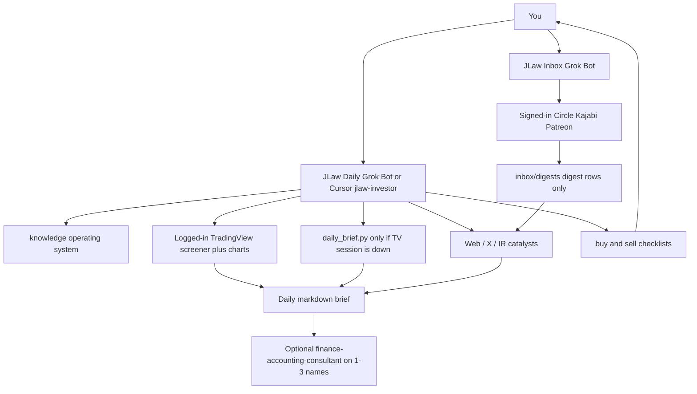

# JLaw Daily — Grok Bot + Cursor

Personal US-equity desk: **screen leaders**, **check news / 催化劑**, **review the watchlist**. Doctrine is distilled from the user's Train-the-Trader materials into `knowledge/` (those PDFs stay on your machine — they are not in git).

> **Disclaimer:** Research support only — not investment, tax, or legal advice. The Bot never places orders.

---

## Start here

| If you use | Do this |
|------------|---------|
| **Grok Bot app** | Follow **[`grok-bot/SETUP.md`](grok-bot/SETUP.md)** then **[`grok-bot/SETUP-TRADINGVIEW-LOGIN.md`](grok-bot/SETUP-TRADINGVIEW-LOGIN.md)** (your TV account = accurate screen) |
| **Cursor** | Open the **repo root**, then `Use jlaw-investor.` |

Paste-ready Bot profile: [`grok-bot/PROFILE.md`](grok-bot/PROFILE.md)  
**Where to click in the app:** [`grok-bot/WHERE-TO-CLICK.md`](grok-bot/WHERE-TO-CLICK.md)  
Second Bot (**JLaw Inbox**): [`grok-bot/PROFILE-inbox.md`](grok-bot/PROFILE-inbox.md) + [`grok-bot/HANDOFF-INBOX.md`](grok-bot/HANDOFF-INBOX.md)

---

## What lives in this folder

| Path | Purpose |
|------|---------|
| [`knowledge/jlaw-operating-system.md`](knowledge/jlaw-operating-system.md) | Durable rules (stops, no average-down, 5% chase cap, regime) |
| [`knowledge/buy-checklist.md`](knowledge/buy-checklist.md) | Pre-order gate |
| [`knowledge/sell-checklist.md`](knowledge/sell-checklist.md) | Lock-profit vs risk-control |
| [`playbooks/daily-brief.md`](playbooks/daily-brief.md) | Morning output template |
| [`playbooks/stock-screen.md`](playbooks/stock-screen.md) | Stage 2 quant workflow |
| [`playbooks/tradingview-logged-in-screen.md`](playbooks/tradingview-logged-in-screen.md) | **Accurate path:** your TV saved screener + charts |
| [`grok-bot/SETUP-TRADINGVIEW-LOGIN.md`](grok-bot/SETUP-TRADINGVIEW-LOGIN.md) | Sign the Bot into TradingView (you type the password) |
| [`tradingview/jlaw-stage2-flags.pine`](tradingview/jlaw-stage2-flags.pine) | Optional Pine Screener helper (Premium) |
| [`playbooks/news-catalyst.md`](playbooks/news-catalyst.md) | 催化劑 vs 消息 |
| [`playbooks/community-digest.md`](playbooks/community-digest.md) | Official JLaw posts → digest rows (Inbox Bot) |
| [`inbox/`](inbox/) | Digest files + `seen.json` (no full lessons) |
| [`playbooks/position-review.md`](playbooks/position-review.md) | Daily holdings / watchlist |
| [`scripts/daily_brief.py`](scripts/daily_brief.py) | Scanner + sector rank + optional earnings dates |
| [`scripts/jlaw_stage2_screen.py`](scripts/jlaw_stage2_screen.py) | TradingView Stage 2 screen (no API key) |
| [`templates/watchlist.example.md`](templates/watchlist.example.md) | Copy to `watchlist.md` (gitignored) |
The Cursor `tradingview` MCP in this repo is the **public** scanner (no login). Accurate JLaw chart work is Grok Bot’s signed-in browser session, not that MCP.

---

## One-off commands

```bash
pip install -r investment/scripts/requirements-tradingview.txt

python investment/scripts/daily_brief.py --limit 25 --markdown
python investment/scripts/jlaw_stage2_screen.py --limit 40
python investment/scripts/jlaw_stage2_screen.py --hard-only --json
# optional: python investment/scripts/daily_brief.py --limit 10 --earnings
```

Write a file the Bot can reopen:

```bash
python investment/scripts/daily_brief.py --limit 25 --out investment/briefs/$(date +%F).md
```

---

## Weekday loop (Hong Kong)

```text
07:30 HKT  AUTOMATIC: Grok routine runs daily_brief.py (+ TV charts if already logged in)
           Reads latest investment/inbox/digests/ as 催化劑 hints. You only read the brief.
08:15 HKT  JLaw Inbox polls Circle / Kajabi / Patreon (if sessions live)
20:30 HKT  Optional pre-US-open card (same: never wait on login)
21:00 HKT  JLaw Inbox second poll
After fill You set the stop. Never average down.
```

How to turn that on: [`grok-bot/AUTO.md`](grok-bot/AUTO.md)

---

## Sensitivity

| Data | Tier | Tool |
|------|------|------|
| Public tickers, news, charts | Low | Grok Bot / Cursor / web |
| Rounded weights | Mid | Local; de-ID before Gemini |
| Broker exports, exact balances, tax lots | High | `work-briefs/` only |

---

## Architecture



Personal investing is **not** routed through the MBA consultant panel unless you ask for a statement/DCF deep dive.

---

## Related

- [Grok Bot setup](grok-bot/SETUP.md)
- [Sign into TradingView](grok-bot/SETUP-TRADINGVIEW-LOGIN.md)
- [JLaw Inbox handoff](grok-bot/HANDOFF-INBOX.md)
- [Finance consultant](../agents/02-finance-accounting.md) (finalists only)
- [Privacy policy](../privacy-policy.md)
